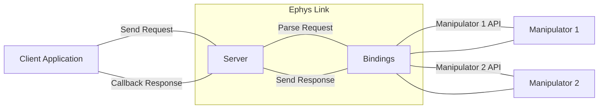
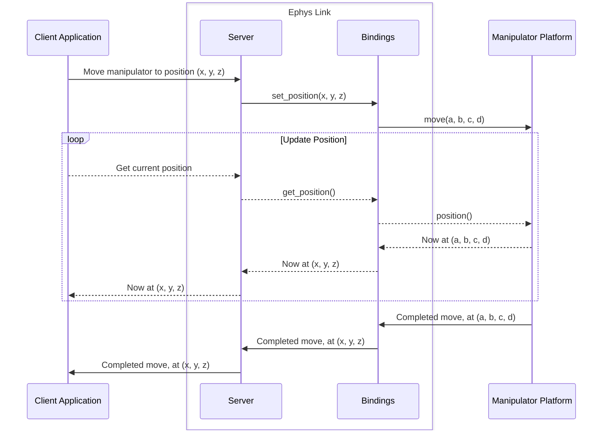

This section provides an overview of how Ephys Link works. It is intended for users who want to understand the
software's architecture and how it interacts with other systems.

## Why Ephys Link?

There exists many manipulator platforms in neuroscience research, each with their own API and software. This diversity
makes it difficult for tool developers to support multiple platforms. Ephys Link aims to solve this problem by providing
a unified API for interacting with manipulators. This allows developers to write code that works with any manipulator
supported by Ephys Link.

## Ephys Link Architecture

This diagram shows the high-level architecture of Ephys Link. Ephys Link acts as an intermediary between client
applications and manipulators.

Within Ephys Link, there is a server component that handled external communication and there are the bindings for each
proprietary manipulator platform API. The server passes requests from client applications to the appropriate manipulator
bindings which convert the requests to the appropriate manipulator API calls.

## Example Message Flow

Consider the following example of a request to move a manipulator to a specific position:

Some things to notice:

- The client application only ever speaks in (x, y, z) coordinates, never in the native manipulator platform's
  coordinate system. The binding handles the conversion.
- While one command is being fulfilled, the client application can still query the manipulator's current position.
  Later, the manipulator can report when it is done and complete the movement request.
- The manipulator often has a different API than Ephys Link (`move` vs `set_position`), but the binding handles the
  translation.